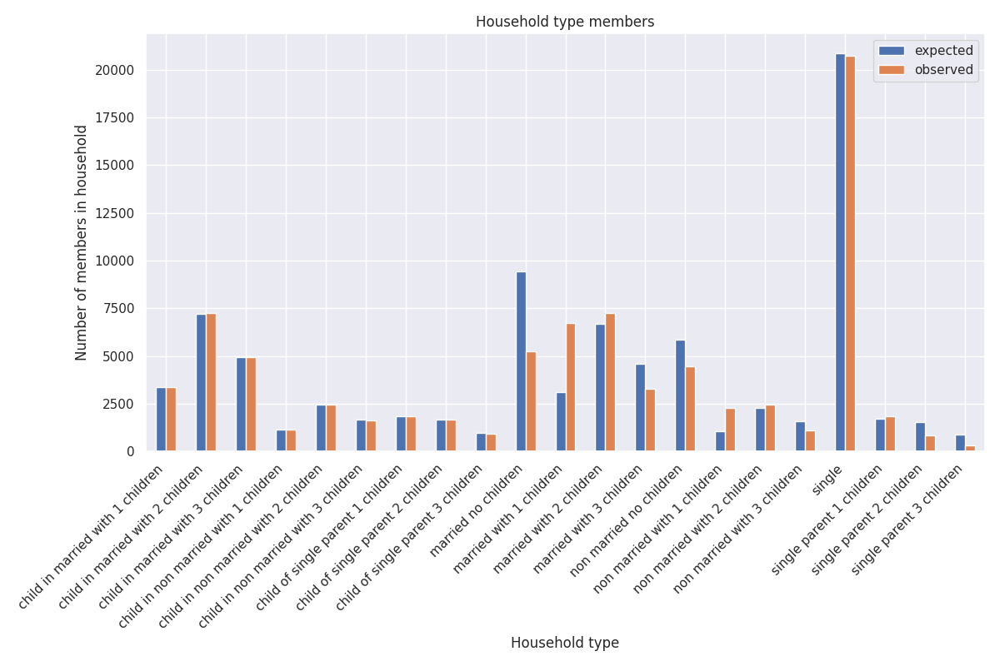

This repository contains the implementation
of [GenSynthPop](https://github.com/A-Practical-Agent-Programming-Language/GenSynthPop-Python)
for the South-West district of The Hague, The Netherlands.

The synthetic population is generated for 14 neighborhoods and contains 10 individual-level attributes and 5
household-level attributes. The attributes are shown in the first column in the two tables in the
[Evaluation](#Evaluation) section below.

The synthetic population was generated as a case study
for [GenSynthPop](https://github.com/A-Practical-Agent-Programming-Language/GenSynthPop-Python),
which was reported on in the paper
*GenSynthPop: Generating a Spatially Explicit Synthetic Population of Agents and Households from Aggregated Data*[^1].
For a full report on the evaluation, please refer to that paper.

[^1]: Marco Pellegrino, Jan de Mooij, Tabea Sonnenschein et al. *GenSynthPop: Generating a Spatially Explicit Synthetic
Population of Agents and Households from Aggregated Data*, 09 October 2023, PREPRINT (Version 1) available at Research
Square [https://doi.org/10.21203/rs.3.rs-3405645/v1]

# Neighborhoods

The fourteen neighborhoods are located in the South-West District of The Hague ('s Gravenhage), The Netherlands:

| Neighborhood Code (CBS) | Neighborhood Name          |
|-------------------------|----------------------------|
| BU05181785              | Kerketuinen en Zichtenburg |
| BU05183284              | Leyenburg                  |
| BU05183387              | Venen, Oorden en Raden     |
| BU05183396              | Zijden, Steden en Zichten  |
| BU05183398              | Dreven en Gaarden          |
| BU05183399              | De Uithof                  |
| BU05183480              | Morgenstond-Zuid           |
| BU05183488              | Morgenstond-West           |
| BU05183489              | Morgenstond-Oost           |
| BU05183536              | Zuiderpark                 |
| BU05183620              | Moerwijk-Oost              |
| BU05183637              | Moerwijk-West              |
| BU05183638              | Moerwijk-Noord             |
| BU05183639              | Moerwijk-Zuid              |

The following map shows where in The Netherlands this synthetic population is located, and what the region looks like:


# Data sets:

All data sets have been obtained through the [Open Data](https://opendata.cbs.nl) portal of
the [Statistics Netherlands](https://www.cbs.nl/en-gb/)
(Centraal Bureau voor de Statistiek or [CBS](https://www.cbs.nl/) in Dutch).

All data sources have been made available by CBS under the
[CC BY 4.0](https://creativecommons.org/licenses/by/4.0/deed.en) license, as
stated [here](https://www.cbs.nl/en-gb/about-us/website/copyright).

1. [`marginal`](datasources/marginal)
    1. [marginal_distributions_84583NED.csv](datasources/marginal/marginal_distributions_84583NED.csv). Source: [
       *Kerncijfers wijken en buurten 2019*](https://opendata.cbs.nl/#/CBS/nl/dataset/84583NED/table?dl=A82FC) (CBS
       StatLine):
    2. [Regionale_kerncijfers_Nederland_19052024_185018.csv](datasources/marginal/Regionale_kerncijfers_Nederland_19052024_185018.csv).
       Source: [*Regionale kerncijfers Nederland*](https://opendata.cbs.nl/#/CBS/nl/dataset/70072ned/table?dl=A6290) (
       CBS StatLine)
2. [`individual`](datasources/individual)
    1. [`gender`](datasources/individual/gender)
        1. [gender_age-03759NED-formatted.csv](datasources/individual/gender/gender_age-03759NED-formatted.csv).
           Source: [*Bevolking op 1 januari en gemiddeld; geslacht, leeftijd en
           regio*](https://opendata.cbs.nl/#/CBS/nl/dataset/03759ned/table?dl=A832A) (CBS StatLine)
    2. [`integer_age`](datasources/individual/integer_age)
        1. [Leeftijdsopbouw Nederland 2019.csv](datasources/individual/integer_age/Leeftijdsopbouw%20Nederland%202019.csv).
           Source: [
           *Bevolkingspiramide*](https://www.cbs.nl/nl-nl/visualisaties/dashboard-bevolking/bevolkingspiramide) (CBS)
    3. [`migration_background`](datasources/individual/migration_background)
        1. [Bev__migratieachtergr__regio__2010_2022_29122023_115517.csv](datasources/individual/migration_background/).
           Source: [*Bevolking; migratieachtergrond, generatie, lft, regio, 1 jan;
           2010-2022*](https://opendata.cbs.nl/#/CBS/nl/dataset/84910NED/table?dl=9D32C) (CBS StatLine)
    4. [`education`](datasources/individual/education)
        1. [Primair_onderwijs__schoolregio_18012024_150722.csv](datasources/individual/education/Primair_onderwijs__schoolregio_18012024_150722.csv).
           Source: [*(Speciaal) basisonderwijs en speciale scholen; leerlingen,
           schoolregio*](https://opendata.cbs.nl/statline/#/CBS/nl/dataset/71478NED/table?dl=9E57F) (CBS StatLine)
        2. [Studenten__woonregio_2000_2022_18012024_150722.csv](datasources/individual/education/Studenten__woonregio_2000_2022_18012024_150722.csv).
           Source: [*Leerlingen en studenten; onderwijssoort, woonregio 2000/'01-2022/'
           23*](https://opendata.cbs.nl/#/CBS/nl/dataset/71450NED/table?dl=9E581) (CBS StatLine)
        3. [Bevolking__onderwijsniveau_en_herkomst_26012024_115001.csv](datasources/individual/education/Bevolking__onderwijsniveau_en_herkomst_26012024_115001.csv).
           Source: [*Bevolking; hoogst behaald onderwijsniveau en
           herkomst*](https://opendata.cbs.nl/#/CBS/nl/dataset/85453NED/table?dl=9EDBE) (CBS StatLine)
    5. [`drivers_license`](datasources/individual/drivers_license)
        1. [Personen_met_rijbewijs__categorie__regio_19052024_184228.csv](datasources/individual/drivers_license/Personen_met_rijbewijs__categorie__regio_19052024_184228.csv).
           Source: [*Personen met een rijbewijs; rijbewijscategorie, leeftijd, regio, 1
           januari*](https://opendata.cbs.nl/#/CBS/nl/dataset/83488NED/table?dl=A628D) (CBS StatLine)
    6. [`household_position`](datasources/individual/household_position)
        1. [Huishoudens__personen__regio_26122023_151215.csv](datasources/individual/household_position/Huishoudens__personen__regio_26122023_151215.csv).
           Source: [*Huishoudens; personen naar geslacht, leeftijd en regio, 1
           januari*](https://opendata.cbs.nl/#/CBS/nl/dataset/71488ned/table?dl=9D241) (CBS StatLine)
        2. [Huishoudens__samenstelling__regio_25052024_174751.csv](datasources/individual/household_position/Huishoudens__samenstelling__regio_25052024_174751.csv).
           Source: [*Huishoudens; samenstelling, grootte, regio, 1
           januari*](https://opendata.cbs.nl/#/CBS/nl/dataset/71486ned/table?dl=A68AA) (CBS StatLine)
3. [`household`](datasources/household)
    1. [`household_composition`](datasources/household/household_composition)
        1. [table_7ab235bf-b5a7-4077-bf56-3f5c8efec7d0.csv](datasources/household/household_composition/table_7ab235bf-b5a7-4077-bf56-3f5c8efec7d0.csv).
           Source: [*Groom usually older than
           bride*](https://www.cbs.nl/en-gb/news/2019/07/groom-usually-older-than-bride) (CBS)
        2. [Marriages__key_figures_25052024_182843.csv](datasources/household/household_composition/Marriages__key_figures_25052024_182843.csv).
           Source: [*Marriages and partnership registrations; key
           figures*](https://opendata.cbs.nl/#/CBS/en/dataset/37772eng/table?dl=A68BB) (CBS StatLine)
        3. [Geboorte__kerncijfers_per_regio_25052024_182014.csv](datasources/household/household_composition/Geboorte__kerncijfers_per_regio_25052024_182014.csv).
           Source: [*Geboorte; kerncijfers vruchtbaarheid, leeftijd moeder,
           regio*](https://opendata.cbs.nl/#/CBS/nl/dataset/37201/table?dl=A68B5) (CBS StatLine)
    2. [`postal_code`](datasources/household/postal_code)
        1. [pc6hnr20190801_gwb.csv](datasources/household/postal_code/pc6hnr20190801_gwb.csv). Source: [*Buurt, wijk en
           gemeente 2019 voor postcode
           huisnummer*](https://www.cbs.nl/nl-nl/maatwerk/2019/42/buurt-wijk-en-gemeente-2019-voor-postcode-huisnummer)
           (CBS):
    3. [`household_income`](datasources/household/household_income)
        1. [Inkomen_huishoudens__kenmerken__regio_25052024_182249.csv](datasources/household/household_income/Inkomen_huishoudens__kenmerken__regio_25052024_182249.csv).
           Source: [*Inkomen van huishoudens; huishoudenskenmerken, regio (indeling
           2021)*](https://opendata.cbs.nl/#/CBS/nl/dataset/85064NED/table?dl=A68B8) (CBS StatLine)
    4. [`vehicle_ownership`](datasources/household/vehicle_ownership)
        1. [Huishoudens_met_auto_of_motor__2010_2015_14062024_171657.csv](datasources/household/vehicle_ownership/Huishoudens_met_auto_of_motor__2010_2015_14062024_171657.csv).
           Source:
           [*Huishoudens in bezit van auto of motor; huishoudkenmerken,
           2010-2015*](https://opendata.cbs.nl/statline/#/CBS/nl/dataset/81845NED/table?dl=A7D91) (CBS StatLine):

# Evaluation

## Personal Level Attributes


<table border="1" class="dataframe">
  <thead>
    <tr>
      <th></th>
      <th></th>
      <th></th>
      <th colspan="2" halign="left"><i>Z<sup>2</sup></i></th>
      <th colspan="2" halign="left"><i>X<sup>2</sup></i></th>
      <th colspan="2" halign="left">absolute error</th>
    </tr>
    <tr>
      <th></th>
      <th></th>
      <th>DoF</th>
      <th>Score</th>
      <th><i>p</i>-value</th>
      <th>Score</th>
      <th><i>p</i>-value</th>
      <th>total</th>
      <th>standardized</th>
    </tr>
  </thead>
  <tbody>
    <tr>
      <th>age group</th>
      <th>neighborhood</th>
      <td>70</td>
      <td>0.160028</td>
      <td>1.000000</td>
      <td>0.016845</td>
      <td>1.000000</td>
      <td>20.000000</td>
      <td>0.000236</td>
    </tr>
    <tr>
      <th rowspan="2" valign="top">gender</th>
      <th>neighborhood</th>
      <td>28</td>
      <td>0.168613</td>
      <td>1.000000</td>
      <td>0.185536</td>
      <td>1.000000</td>
      <td>26.000000</td>
      <td>0.000306</td>
    </tr>
    <tr>
      <th>age group</th>
      <td>10</td>
      <td>0.612648</td>
      <td>0.999983</td>
      <td>0.579719</td>
      <td>0.999987</td>
      <td>150.559563</td>
      <td>0.001773</td>
    </tr>
    <tr>
      <th rowspan="2" valign="top">integer age</th>
      <th></th>
      <td>106</td>
      <td>2.144096</td>
      <td>1.000000</td>
      <td>3.601348</td>
      <td>1.000000</td>
      <td>124.606355</td>
      <td>0.001468</td>
    </tr>
    <tr>
      <th>gender</th>
      <td>212</td>
      <td>26.086832</td>
      <td>1.000000</td>
      <td>31.153039</td>
      <td>1.000000</td>
      <td>1183.331065</td>
      <td>0.013938</td>
    </tr>
    <tr>
      <th rowspan="4" valign="top">migration background</th>
      <th>neighborhood</th>
      <td>42</td>
      <td>0.191206</td>
      <td>1.000000</td>
      <td>0.500781</td>
      <td>1.000000</td>
      <td>62.000000</td>
      <td>0.000730</td>
    </tr>
    <tr>
      <th>age group</th>
      <td>60</td>
      <td>26.784031</td>
      <td>0.999936</td>
      <td>27.521184</td>
      <td>0.999898</td>
      <td>1175.066312</td>
      <td>0.013844</td>
    </tr>
    <tr>
      <th>gender</th>
      <td>6</td>
      <td>1.421525</td>
      <td>0.964536</td>
      <td>1.140259</td>
      <td>0.979733</td>
      <td>296.952058</td>
      <td>0.003498</td>
    </tr>
    <tr>
      <th>age group &#215; gender</th>
      <td>120</td>
      <td>27.329810</td>
      <td>1.000000</td>
      <td>30.074286</td>
      <td>1.000000</td>
      <td>1195.071783</td>
      <td>0.014080</td>
    </tr>
    <tr>
      <th rowspan="5" valign="top">absolved education</th>
      <th></th>
      <td>9</td>
      <td>0.522445</td>
      <td>0.999963</td>
      <td>0.490611</td>
      <td>0.999972</td>
      <td>151.258870</td>
      <td>0.001782</td>
    </tr>
    <tr>
      <th>neighborhood</th>
      <td>42</td>
      <td>0.066162</td>
      <td>1.000000</td>
      <td>0.237732</td>
      <td>1.000000</td>
      <td>43.868289</td>
      <td>0.000517</td>
    </tr>
    <tr>
      <th>age group</th>
      <td>171</td>
      <td>69.205262</td>
      <td>1.000000</td>
      <td>71.689507</td>
      <td>1.000000</td>
      <td>1392.723678</td>
      <td>0.016408</td>
    </tr>
    <tr>
      <th>gender</th>
      <td>18</td>
      <td>3.668375</td>
      <td>0.999874</td>
      <td>3.583914</td>
      <td>0.999894</td>
      <td>460.845914</td>
      <td>0.005429</td>
    </tr>
    <tr>
      <th>age group &#215; gender</th>
      <td>342</td>
      <td>73.542488</td>
      <td>1.000000</td>
      <td>78.444162</td>
      <td>1.000000</td>
      <td>1438.030022</td>
      <td>0.016942</td>
    </tr>
    <tr>
      <th rowspan="16" valign="top">current education</th>
      <th></th>
      <td>18</td>
      <td>5.271613</td>
      <td>0.998370</td>
      <td>5.559259</td>
      <td>0.997681</td>
      <td>241.257163</td>
      <td>0.002842</td>
    </tr>
    <tr>
      <th>age group</th>
      <td>738</td>
      <td>400.828726</td>
      <td>1.000000</td>
      <td>88.304314</td>
      <td>1.000000</td>
      <td>344.817221</td>
      <td>0.004062</td>
    </tr>
    <tr>
      <th>gender</th>
      <td>36</td>
      <td>5.406962</td>
      <td>1.000000</td>
      <td>6.937750</td>
      <td>1.000000</td>
      <td>265.580831</td>
      <td>0.003129</td>
    </tr>
    <tr>
      <th>migration background</th>
      <td>54</td>
      <td>13.529318</td>
      <td>1.000000</td>
      <td>9.604675</td>
      <td>1.000000</td>
      <td>255.267884</td>
      <td>0.003007</td>
    </tr>
    <tr>
      <th>absolved education</th>
      <td>162</td>
      <td>6.639501</td>
      <td>1.000000</td>
      <td>6.341646</td>
      <td>1.000000</td>
      <td>241.481890</td>
      <td>0.002845</td>
    </tr>
    <tr>
      <th>age group &#215; gender</th>
      <td>1476</td>
      <td>707.310600</td>
      <td>1.000000</td>
      <td>122.133588</td>
      <td>1.000000</td>
      <td>415.442018</td>
      <td>0.004894</td>
    </tr>
    <tr>
      <th>age group &#215; migration background</th>
      <td>2214</td>
      <td>853.547746</td>
      <td>1.000000</td>
      <td>108.171522</td>
      <td>1.000000</td>
      <td>392.444181</td>
      <td>0.004624</td>
    </tr>
    <tr>
      <th>age group &#215; absolved education</th>
      <td>6642</td>
      <td>464.316168</td>
      <td>1.000000</td>
      <td>92.685205</td>
      <td>1.000000</td>
      <td>360.126489</td>
      <td>0.004243</td>
    </tr>
    <tr>
      <th>gender &#215; migration background</th>
      <td>108</td>
      <td>20.653331</td>
      <td>1.000000</td>
      <td>13.456209</td>
      <td>1.000000</td>
      <td>281.248106</td>
      <td>0.003313</td>
    </tr>
    <tr>
      <th>gender &#215; absolved education</th>
      <td>324</td>
      <td>7.692929</td>
      <td>1.000000</td>
      <td>8.568989</td>
      <td>1.000000</td>
      <td>271.231784</td>
      <td>0.003195</td>
    </tr>
    <tr>
      <th>migration background &#215; absolved education</th>
      <td>486</td>
      <td>19.424479</td>
      <td>1.000000</td>
      <td>12.676304</td>
      <td>1.000000</td>
      <td>258.486825</td>
      <td>0.003045</td>
    </tr>
    <tr>
      <th>age group &#215; gender &#215; migration background</th>
      <td>4428</td>
      <td>1574.162354</td>
      <td>1.000000</td>
      <td>157.970713</td>
      <td>1.000000</td>
      <td>487.830608</td>
      <td>0.005747</td>
    </tr>
    <tr>
      <th>age group &#215; gender &#215; absolved education</th>
      <td>13284</td>
      <td>933.428873</td>
      <td>1.000000</td>
      <td>130.189879</td>
      <td>1.000000</td>
      <td>443.881705</td>
      <td>0.005230</td>
    </tr>
    <tr>
      <th>age group &#215; migration background &#215; absolved education</th>
      <td>19926</td>
      <td>1093.462434</td>
      <td>1.000000</td>
      <td>113.877827</td>
      <td>1.000000</td>
      <td>416.662545</td>
      <td>0.004909</td>
    </tr>
    <tr>
      <th>gender &#215; migration background &#215; absolved education</th>
      <td>972</td>
      <td>29.108628</td>
      <td>1.000000</td>
      <td>21.881322</td>
      <td>1.000000</td>
      <td>305.042419</td>
      <td>0.003594</td>
    </tr>
    <tr>
      <th>age group &#215; gender &#215; migration background &#215; absolved education</th>
      <td>39852</td>
      <td>2194.267693</td>
      <td>1.000000</td>
      <td>167.084847</td>
      <td>1.000000</td>
      <td>527.015116</td>
      <td>0.006209</td>
    </tr>
    <tr>
      <th rowspan="2" valign="top">car license</th>
      <th></th>
      <td>2</td>
      <td>0.000165</td>
      <td>0.999917</td>
      <td>0.000159</td>
      <td>0.999921</td>
      <td>3.595921</td>
      <td>0.000042</td>
    </tr>
    <tr>
      <th>age</th>
      <td>26</td>
      <td>0.005861</td>
      <td>1.000000</td>
      <td>0.006811</td>
      <td>1.000000</td>
      <td>14.370524</td>
      <td>0.000169</td>
    </tr>
    <tr>
      <th rowspan="2" valign="top">motor cycle license</th>
      <th></th>
      <td>2</td>
      <td>0.002777</td>
      <td>0.998612</td>
      <td>0.001954</td>
      <td>0.999024</td>
      <td>6.370590</td>
      <td>0.000075</td>
    </tr>
    <tr>
      <th>age</th>
      <td>26</td>
      <td>0.875771</td>
      <td>1.000000</td>
      <td>1.484794</td>
      <td>1.000000</td>
      <td>15.663175</td>
      <td>0.000185</td>
    </tr>
    <tr>
      <th rowspan="4" valign="top">moped license</th>
      <th></th>
      <td>2</td>
      <td>0.000220</td>
      <td>0.999890</td>
      <td>0.000196</td>
      <td>0.999902</td>
      <td>3.975836</td>
      <td>0.000047</td>
    </tr>
    <tr>
      <th>age</th>
      <td>26</td>
      <td>0.003083</td>
      <td>1.000000</td>
      <td>0.010500</td>
      <td>1.000000</td>
      <td>13.535124</td>
      <td>0.000159</td>
    </tr>
    <tr>
      <th>car license</th>
      <td>4</td>
      <td>0.002277</td>
      <td>0.999999</td>
      <td>0.003920</td>
      <td>0.999998</td>
      <td>3.975836</td>
      <td>0.000047</td>
    </tr>
    <tr>
      <th>age &#215; car license</th>
      <td>52</td>
      <td>0.027725</td>
      <td>1.000000</td>
      <td>0.075585</td>
      <td>1.000000</td>
      <td>13.535124</td>
      <td>0.000159</td>
    </tr>
    <tr>
      <th rowspan="5" valign="top">household position</th>
      <th></th>
      <td>21</td>
      <td>1.803299</td>
      <td>1.000000</td>
      <td>1.847752</td>
      <td>1.000000</td>
      <td>250.398797</td>
      <td>0.002950</td>
    </tr>
    <tr>
      <th>neighborhood</th>
      <td>42</td>
      <td>1.802755</td>
      <td>1.000000</td>
      <td>2.501504</td>
      <td>1.000000</td>
      <td>146.000000</td>
      <td>0.001720</td>
    </tr>
    <tr>
      <th>age group</th>
      <td>420</td>
      <td>249.202608</td>
      <td>1.000000</td>
      <td>126.578850</td>
      <td>1.000000</td>
      <td>754.259661</td>
      <td>0.008886</td>
    </tr>
    <tr>
      <th>gender</th>
      <td>42</td>
      <td>2.699896</td>
      <td>1.000000</td>
      <td>2.918825</td>
      <td>1.000000</td>
      <td>336.681633</td>
      <td>0.003967</td>
    </tr>
    <tr>
      <th>age group &#215; gender</th>
      <td>840</td>
      <td>334.941882</td>
      <td>1.000000</td>
      <td>182.929638</td>
      <td>1.000000</td>
      <td>896.190081</td>
      <td>0.010558</td>
    </tr>
  </tbody>
</table>

## Household Attributes



<table border="1" class="dataframe">
  <thead>
    <tr>
      <th></th>
      <th></th>
      <th></th>
      <th colspan="2" halign="left"><i>Z<sup>2</sup></i></th>
      <th colspan="2" halign="left"><i>X<sup>2</sup></i></th>
      <th colspan="2" halign="left">absolute error</th>
    </tr>
    <tr>
      <th></th>
      <th></th>
      <th>DoF</th>
      <th>Score</th>
      <th><i>p</i>-value</th>
      <th>Score</th>
      <th><i>p</i>-value</th>
      <th>total</th>
      <th>standardized</th>
    </tr>
  </thead>
  <tbody>
    <tr>
      <th>household type</th>
      <th>neighborhood</th>
      <td>42</td>
      <td>906.521255</td>
      <td>0.000000</td>
      <td>894.854325</td>
      <td>0.000000</td>
      <td>4098.000000</td>
      <td>0.096605</td>
    </tr>
    <tr>
      <th>postal code</th>
      <th>neighborhood</th>
      <td>2069</td>
      <td>392.432681</td>
      <td>1.000000</td>
      <td>570.688983</td>
      <td>1.000000</td>
      <td>3199.000000</td>
      <td>0.077825</td>
    </tr>
    <tr>
      <th rowspan="7" valign="top">income_group</th>
      <th>age group</th>
      <td>40</td>
      <td>4.811664</td>
      <td>1.000000</td>
      <td>5.578801</td>
      <td>1.000000</td>
      <td>162.006477</td>
      <td>0.003825</td>
    </tr>
    <tr>
      <th>income household type</th>
      <td>40</td>
      <td>0.858700</td>
      <td>1.000000</td>
      <td>1.054674</td>
      <td>1.000000</td>
      <td>138.199964</td>
      <td>0.003263</td>
    </tr>
    <tr>
      <th>main bread winner migration background</th>
      <td>30</td>
      <td>1.270564</td>
      <td>1.000000</td>
      <td>1.394234</td>
      <td>1.000000</td>
      <td>164.570737</td>
      <td>0.003886</td>
    </tr>
    <tr>
      <th>age group &#215; income household type</th>
      <td>160</td>
      <td>21.969606</td>
      <td>1.000000</td>
      <td>32.654659</td>
      <td>1.000000</td>
      <td>269.499612</td>
      <td>0.006364</td>
    </tr>
    <tr>
      <th>age group &#215; main bread winner migration background</th>
      <td>120</td>
      <td>34.366320</td>
      <td>1.000000</td>
      <td>40.854727</td>
      <td>1.000000</td>
      <td>256.078370</td>
      <td>0.006047</td>
    </tr>
    <tr>
      <th>income household type &#215; main bread winner migration background</th>
      <td>120</td>
      <td>4.172994</td>
      <td>1.000000</td>
      <td>5.809870</td>
      <td>1.000000</td>
      <td>239.738984</td>
      <td>0.005661</td>
    </tr>
    <tr>
      <th>age group &#215; main bread winner migration background &#215; income household type</th>
      <td>480</td>
      <td>57.803160</td>
      <td>1.000000</td>
      <td>76.238676</td>
      <td>1.000000</td>
      <td>420.321388</td>
      <td>0.009925</td>
    </tr>
    <tr>
      <th rowspan="15" valign="top">cars</th>
      <th>income household type</th>
      <td>16</td>
      <td>11.333855</td>
      <td>0.788424</td>
      <td>11.687847</td>
      <td>0.765174</td>
      <td>130.374345</td>
      <td>0.003078</td>
    </tr>
    <tr>
      <th>hh size</th>
      <td>20</td>
      <td>2.453303</td>
      <td>0.999999</td>
      <td>2.831404</td>
      <td>0.999998</td>
      <td>138.374003</td>
      <td>0.003267</td>
    </tr>
    <tr>
      <th>vehicle ownership income group</th>
      <td>20</td>
      <td>3.199855</td>
      <td>0.999993</td>
      <td>4.353822</td>
      <td>0.999907</td>
      <td>115.344156</td>
      <td>0.002724</td>
    </tr>
    <tr>
      <th>car license</th>
      <td>20</td>
      <td>17.717134</td>
      <td>0.606036</td>
      <td>20.764026</td>
      <td>0.411137</td>
      <td>132.576966</td>
      <td>0.003131</td>
    </tr>
    <tr>
      <th>income household type &#215; hh size</th>
      <td>80</td>
      <td>10.263020</td>
      <td>1.000000</td>
      <td>11.653642</td>
      <td>1.000000</td>
      <td>148.560213</td>
      <td>0.003508</td>
    </tr>
    <tr>
      <th>income household type &#215; vehicle ownership income group</th>
      <td>80</td>
      <td>9.298031</td>
      <td>1.000000</td>
      <td>12.164716</td>
      <td>1.000000</td>
      <td>164.088294</td>
      <td>0.003875</td>
    </tr>
    <tr>
      <th>income household type &#215; car license</th>
      <td>80</td>
      <td>27.702845</td>
      <td>1.000000</td>
      <td>31.583354</td>
      <td>1.000000</td>
      <td>134.961108</td>
      <td>0.003187</td>
    </tr>
    <tr>
      <th>hh size &#215; vehicle ownership income group</th>
      <td>100</td>
      <td>6.117136</td>
      <td>1.000000</td>
      <td>8.300281</td>
      <td>1.000000</td>
      <td>170.569850</td>
      <td>0.004028</td>
    </tr>
    <tr>
      <th>hh size &#215; car license</th>
      <td>100</td>
      <td>18.241554</td>
      <td>1.000000</td>
      <td>25.092836</td>
      <td>1.000000</td>
      <td>154.187093</td>
      <td>0.003641</td>
    </tr>
    <tr>
      <th>vehicle ownership income group &#215; car license</th>
      <td>100</td>
      <td>26.546443</td>
      <td>1.000000</td>
      <td>34.161878</td>
      <td>1.000000</td>
      <td>156.713236</td>
      <td>0.003700</td>
    </tr>
    <tr>
      <th>income household type &#215; hh size &#215; vehicle ownership income group</th>
      <td>400</td>
      <td>23.725567</td>
      <td>1.000000</td>
      <td>29.353700</td>
      <td>1.000000</td>
      <td>203.311026</td>
      <td>0.004801</td>
    </tr>
    <tr>
      <th>income household type &#215; hh size &#215; car license</th>
      <td>400</td>
      <td>29.404266</td>
      <td>1.000000</td>
      <td>40.145015</td>
      <td>1.000000</td>
      <td>166.019409</td>
      <td>0.003920</td>
    </tr>
    <tr>
      <th>income household type &#215; vehicle ownership income group &#215; car license</th>
      <td>400</td>
      <td>34.714700</td>
      <td>1.000000</td>
      <td>45.360212</td>
      <td>1.000000</td>
      <td>203.841026</td>
      <td>0.004813</td>
    </tr>
    <tr>
      <th>hh size &#215; vehicle ownership income group &#215; car license</th>
      <td>500</td>
      <td>30.191990</td>
      <td>1.000000</td>
      <td>44.540901</td>
      <td>1.000000</td>
      <td>222.846215</td>
      <td>0.005262</td>
    </tr>
    <tr>
      <th>income household type &#215; hh size &#215; vehicle ownership income group &#215; car license</th>
      <td>2000</td>
      <td>54.483863</td>
      <td>1.000000</td>
      <td>73.215653</td>
      <td>1.000000</td>
      <td>265.690539</td>
      <td>0.006274</td>
    </tr>
    <tr>
      <th rowspan="15" valign="top">motorcycles</th>
      <th>income household type</th>
      <td>16</td>
      <td>3.331365</td>
      <td>0.999661</td>
      <td>3.876334</td>
      <td>0.999100</td>
      <td>37.931565</td>
      <td>0.000896</td>
    </tr>
    <tr>
      <th>hh size</th>
      <td>20</td>
      <td>10.280284</td>
      <td>0.962800</td>
      <td>10.596614</td>
      <td>0.956021</td>
      <td>37.931565</td>
      <td>0.000896</td>
    </tr>
    <tr>
      <th>vehicle ownership income group</th>
      <td>20</td>
      <td>2.359904</td>
      <td>1.000000</td>
      <td>2.954304</td>
      <td>0.999996</td>
      <td>35.458634</td>
      <td>0.000837</td>
    </tr>
    <tr>
      <th>motorcycle license</th>
      <td>12</td>
      <td>1.270946</td>
      <td>0.999947</td>
      <td>1.348853</td>
      <td>0.999926</td>
      <td>35.458634</td>
      <td>0.000837</td>
    </tr>
    <tr>
      <th>income household type &#215; hh size</th>
      <td>80</td>
      <td>13.105943</td>
      <td>1.000000</td>
      <td>14.205072</td>
      <td>1.000000</td>
      <td>37.931565</td>
      <td>0.000896</td>
    </tr>
    <tr>
      <th>income household type &#215; vehicle ownership income group</th>
      <td>80</td>
      <td>7.924885</td>
      <td>1.000000</td>
      <td>11.107216</td>
      <td>1.000000</td>
      <td>44.933394</td>
      <td>0.001061</td>
    </tr>
    <tr>
      <th>income household type &#215; motorcycle license</th>
      <td>48</td>
      <td>3.537022</td>
      <td>1.000000</td>
      <td>4.063794</td>
      <td>1.000000</td>
      <td>37.931565</td>
      <td>0.000896</td>
    </tr>
    <tr>
      <th>hh size &#215; vehicle ownership income group</th>
      <td>100</td>
      <td>9.686371</td>
      <td>1.000000</td>
      <td>12.806302</td>
      <td>1.000000</td>
      <td>49.673925</td>
      <td>0.001173</td>
    </tr>
    <tr>
      <th>hh size &#215; motorcycle license</th>
      <td>60</td>
      <td>10.822410</td>
      <td>1.000000</td>
      <td>11.299931</td>
      <td>1.000000</td>
      <td>37.931565</td>
      <td>0.000896</td>
    </tr>
    <tr>
      <th>vehicle ownership income group &#215; motorcycle license</th>
      <td>60</td>
      <td>2.479304</td>
      <td>1.000000</td>
      <td>3.112846</td>
      <td>1.000000</td>
      <td>35.458634</td>
      <td>0.000837</td>
    </tr>
    <tr>
      <th>income household type &#215; hh size &#215; vehicle ownership income group</th>
      <td>400</td>
      <td>16.255885</td>
      <td>1.000000</td>
      <td>19.531411</td>
      <td>1.000000</td>
      <td>50.254357</td>
      <td>0.001187</td>
    </tr>
    <tr>
      <th>income household type &#215; hh size &#215; motorcycle license</th>
      <td>240</td>
      <td>13.667388</td>
      <td>1.000000</td>
      <td>14.965049</td>
      <td>1.000000</td>
      <td>37.931565</td>
      <td>0.000896</td>
    </tr>
    <tr>
      <th>income household type &#215; vehicle ownership income group &#215; motorcycle license</th>
      <td>240</td>
      <td>8.115136</td>
      <td>1.000000</td>
      <td>11.201584</td>
      <td>1.000000</td>
      <td>44.933394</td>
      <td>0.001061</td>
    </tr>
    <tr>
      <th>hh size &#215; vehicle ownership income group &#215; motorcycle license</th>
      <td>300</td>
      <td>10.301489</td>
      <td>1.000000</td>
      <td>13.574983</td>
      <td>1.000000</td>
      <td>49.673925</td>
      <td>0.001173</td>
    </tr>
    <tr>
      <th>income household type &#215; hh size &#215; vehicle ownership income group &#215; motorcycle license</th>
      <td>1200</td>
      <td>16.946660</td>
      <td>1.000000</td>
      <td>20.319974</td>
      <td>1.000000</td>
      <td>50.254357</td>
      <td>0.001187</td>
    </tr>
  </tbody>
</table>

# Using this repository

This repository uses [Git LFS](https://git-lfs.com/). Before cloning this repository, make sure to run

```bash
git lfs install
```

After cloning, create a virtual environment, and install the requirements:

```bash
python -m venv env
source env/bin/activate
pip install -r requirements.txt
```

First, the individual level attributes should be created:

```bash
python3 generate_individuals.py
```

This adds the configured attributes one at a time. After each attribute, the intermediate stage of the synthetic
population
is stored as both a CSV file and a Pandas DataFrame pickle. If these files already exist, the step is not executed again
when the above code is run again. To make sure changes take place, remove files from output from the version and onwards
where changes need to be applied.

The second step is the household generation:

```bash
python3 generate_households.py
```

This also runs in multiple steps, and again stores the intermediate results. In this step, both the synthetic population
and the synthetic household may change at every stage, so both are stored for each stage, even if no changes occur.


